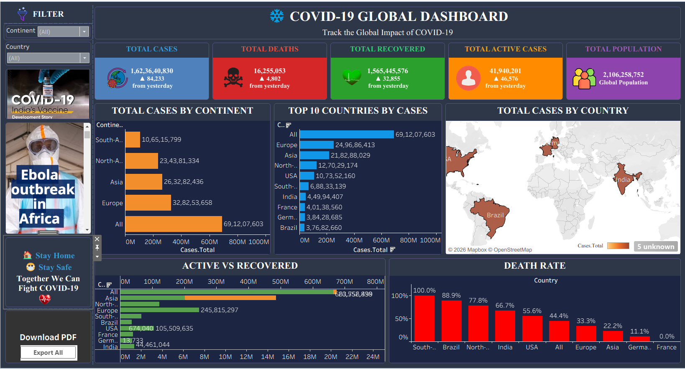

# 🌍 COVID-19 Global Dashboard | Tableau

An interactive Tableau dashboard that provides a comprehensive analysis of worldwide COVID-19 statistics using dynamic visualizations, KPI cards, maps, and charts. The dashboard helps users understand the global impact of the pandemic through country-wise and continent-wise analysis.

## 📌 Project Overview

The **COVID-19 Global Dashboard** is a data visualization project developed using **Tableau Desktop**. It transforms raw COVID-19 data into an interactive dashboard that presents key pandemic metrics, enabling users to explore trends and compare statistics across countries and continents.

## 🎯 Business Objective

- Monitor global COVID-19 statistics.
- Compare cases across countries and continents.
- Analyze active, recovered, and death cases.
- Identify the top affected countries.
- Present data through interactive visualizations for better decision-making.

## 📸 Dashboard Preview

## 🌐 Live Dashboard

👉 **View the Interactive Dashboard on Tableau Public:**

**🔗 https://lnkd.in/dKJuimdF**

## 🛠️ Tools & Technologies

- Tableau Desktop
- CSV Dataset
- Data Visualization
- Dashboard Design
- KPI Analysis

## 📂 Dataset Details

The dataset includes:

- Country
- Continent
- Population
- Total Cases
- Active Cases
- Total Recovered
- Total Deaths
- Death Rate

## ✨ Dashboard Features

- 🌍 Global COVID-19 Overview
- 📊 KPI Cards
  - Total Cases
  - Total Deaths
  - Total Population
  - Total Active Cases
  - Total Recovered
- 🌎 Country-wise Analysis
- 🌍 Continent-wise Analysis
- 🏆 Top 10 Countries by Total Cases
- 📈 Active vs Recovered Comparison
- 📉 Death Rate Analysis
- 🎛️ Interactive Filters

## 📈 Key Insights

- Identifies the countries with the highest COVID-19 cases.
- Compares active and recovered cases worldwide.
- Shows continent-wise distribution of confirmed cases.
- Highlights recovery and mortality trends.
- Provides an interactive view of global pandemic statistics.

## 📊 Dashboard Components

- Total Cases
- Total Deaths
- Total Population
- Total Active Cases
- Total Recovered
- Active vs Recovered
- Death Rate
- Total Cases by Continent
- Top 10 Countries by Cases
- Country Analysis

## 📁 Repository Structure

| Folder | Description |
|--------|-------------|
| 📁 Dashboard | Contains the Tableau workbook (`COVID-19 GLOBAL DASHBOARD.twb`) |
| 📁 Dataset | Contains the COVID-19 dataset (`covid_data.csv`) |
| 📁 Images | Contains dashboard screenshots used in the README |
| 📄 README.md | Project documentation and instructions |

## 🚀 How to Use

1. Clone or download this repository.
2. Open **COVID-19 GLOBAL DASHBOARD.twb** in Tableau Desktop.
3. If prompted, reconnect the dataset from the **Dataset** folder.
4. Explore the interactive dashboard.

## 💡 Skills Demonstrated

- Data Analysis
- Data Visualization
- Tableau Dashboard Development
- KPI Design
- Dashboard Storytelling
- Business Intelligence
- Analytical Thinking

## 🔮 Future Enhancements

- Add vaccination statistics.
- Connect to live COVID-19 APIs.
- Include time-series forecasting.
- Add additional interactive filters.

## 👩‍💻 Author

**Falguni Khot**

**Aspiring Data Analyst | AI & Machine Learning Enthusiast**

### Technical Skills

- Python
- SQL
- Tableau
- Power BI
- Microsoft Excel
- Data Analysis
- Data Visualization

⭐ **If you found this project helpful, consider giving it a Star on GitHub!**
